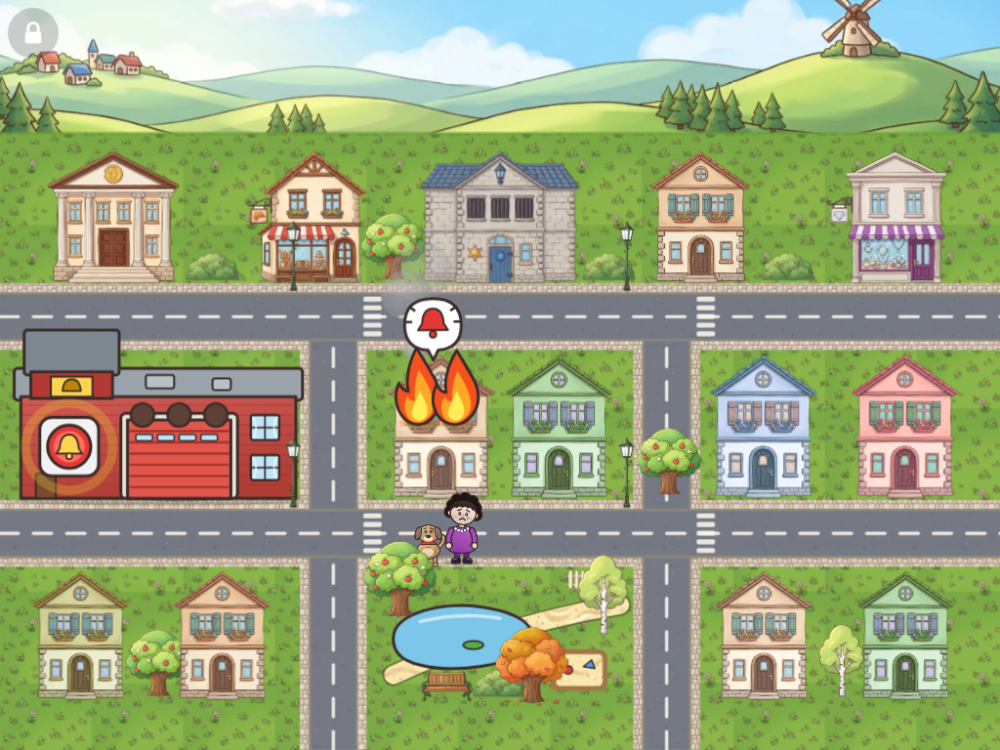
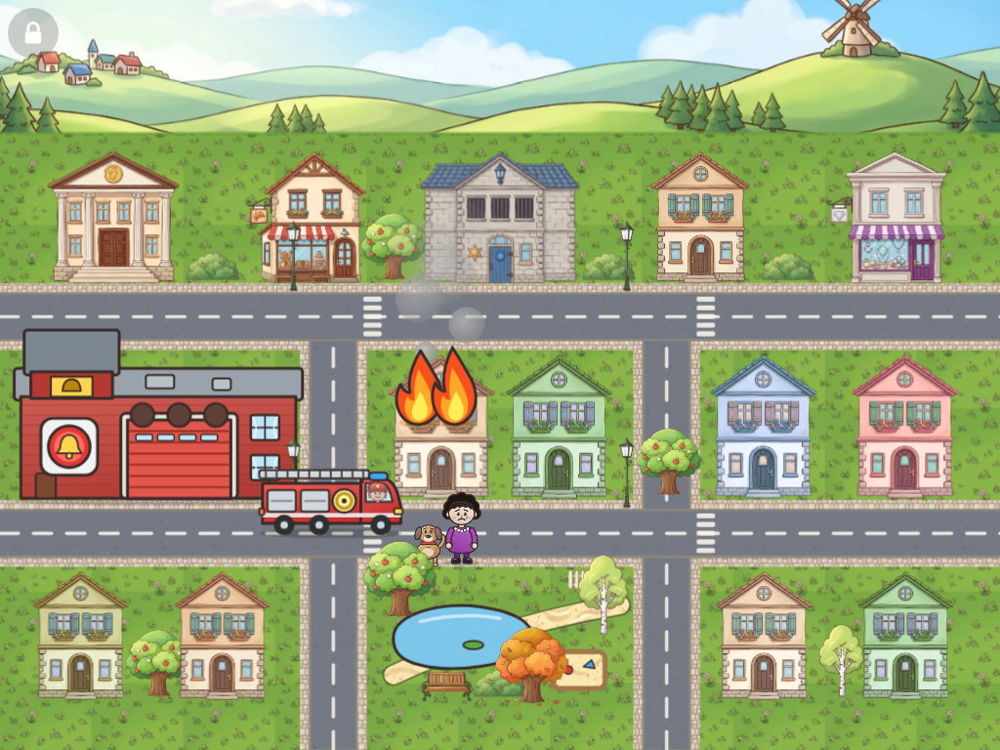
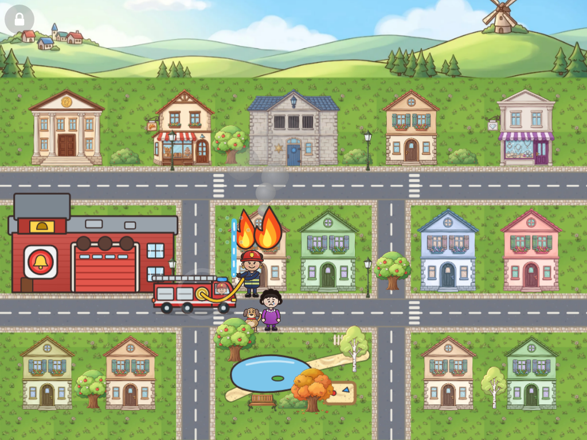
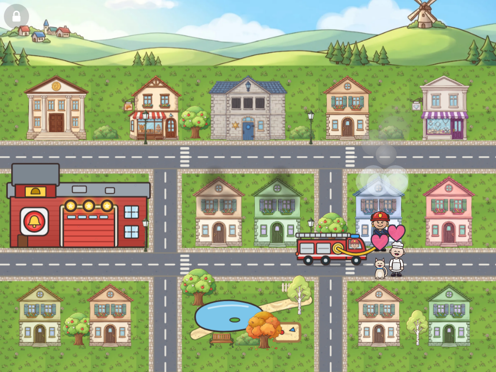
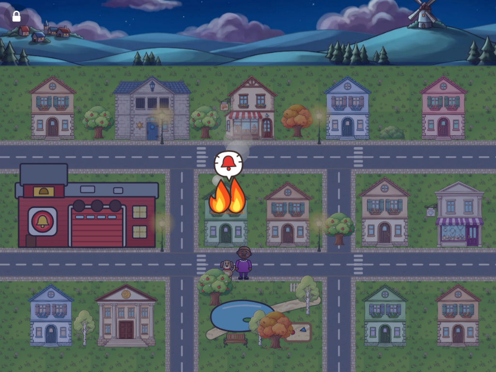
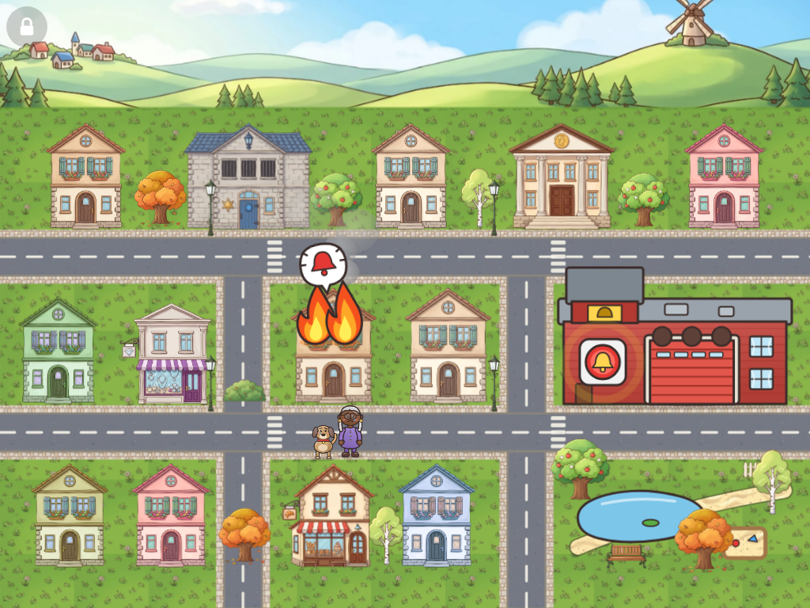

# Palokunta: the firefighter game mode

A second game mode next to *Poliisi ja rosvo*. Same audience (a 4-year-old on
a landscape tablet), same rules of thumb: no text, no failing, one finger,
big targets, gentle help after 10 seconds of nothing.

## 1. Concept

The child is the fire brigade of a small town. A fire starts in one of the
houses, the child raises the alarm, drives the fire truck out of the station,
steers it through the streets to the fire and puts the fire out with the hose.
The people come out, cheer, and the truck goes home.

Fire is scary in real life, so here it stays friendly:

- Flames have faces only at a glance (round, soft shapes, warm colours), smoke
  is grey and puffy, never black.
- Nobody is ever inside a burning room: the residents (and their cat or dog)
  are already out on the sidewalk, worried but safe, when the child arrives.
- A fire never spreads to another house and never destroys anything. If the
  child waits, the fire just keeps flickering.
- Afterwards the house is a bit sooty, and is clean again by the next level
  (the "painters came").

## 2. The town and the camera

The police game shows one street from the side. The fire game needs to show a
route, so the camera moves up: a high "storybook map" view, as in classic
top-down games. Roads are seen from above, while buildings, trees and
vehicles are drawn from the front. There is no perspective scaling:
everything keeps the same size wherever it is, which keeps targets
predictable for small fingers.

```
 y   0 ┌──────────── painted sky and far hills (may be cut off on phones) ───────┐
   120 │  ▲house  ▲shop   ▲police  ▲house  ▲house      row 0 (faces street 1)     │
   330 ╞══════════════════════ street 1 ═══════════════════════════════════════════╡
       │  FIRE STATION   ║   ▲house ▲house   ║   ▲house ▲shop    row 1             │
   590 ╞════════════════ street 2 ═══════════╬═══════════════════╬═══════════════════╡
       │  ▲house ▲house  ║   park, pond      ║   ▲house ▲house   row 2             │
   800 └─────────────────╨───────────────────╨───────────────────────────────────┘
                      lane 1               lane 2
```

**The plan changes every session** (every page load), like the police town,
and stays the same during a session so the way to the station can be learned:

- The two cross lanes move: one of five lane plans is picked. Each leaves at
  least one block in row 1 wide enough for the fire station.
- The fire station goes in a random row 1 block, the park in a random row 2
  block, the police station on a random back-row plot.
- The other blocks are split into house plots. The bakery, bank and
  jewellery shop appear once each; the rest are homes. Homes cycle through
  every home picture there is, and repeats get a gentle colour change (and
  sometimes a mirror image).
- Trees and bushes fill the gaps between buildings; street lamps stand on
  the corners.
- The road network for the truck is built from the plan, so route-finding
  works for any layout.

Rules a plan must keep: buildings in different rows never overlap (that keeps
the drawing order simple), every plot has a road beside it for the truck,
and the station faces street 2.

- Vehicles show their side when they drive left/right and their front or
  back when they drive down/up.
- On wide screens (phones, 16:10 tablets) up to 110 px of sky is trimmed from
  the top, exactly like the police game trims its sky.

## 3. One round (one fire)

| # | What happens | What the child does | Feedback |
|---|---|---|---|
| 1 | **Calm.** People stroll, birds fly. After a few seconds smoke curls out of one house, then a small flame appears in a window. The residents hurry out onto the sidewalk. | Nothing yet. | Crackle sound, a bell bubble above the house. |
| 2 | **Alarm.** The big red alarm button on the station wall starts to pulse. | **Tap the alarm.** | Alarm bell, the station's light spins, the garage door rolls up. |
| 3 | **Truck out.** The truck rolls out of the garage onto street 2 by itself, siren on. | — | Two-tone siren, flashing lights. |
| 4 | **Drive.** The truck waits, bouncing gently. | **Drag the truck.** It follows the finger but stays on the roads, turning at corners by itself (the nearest point on a road to the finger is the goal; the truck takes the shortest way there). | Engine hum. When it gets close to the burning house it snaps into the parking spot. |
| 5 | **Hose.** The firefighter hops out. The hose reel on the truck wiggles. | **Tap the hose.** | The firefighter grabs the nozzle and steps to the sidewalk; the hose unrolls from the truck. |
| 6 | **Water.** | **Touch the fire.** While the finger is down, water arcs from the nozzle to the finger. Flames under the water shrink and go out with a hiss and a puff of steam. | Splash at the finger, spray sound, sizzle per flame. |
| 7 | **Saved.** Smoke stops, the residents cheer (hearts), one lamp on the station lights up. | — | Cheer. |
| 8 | **Home.** The firefighter rolls up the hose, the truck drives back to the station by itself, the door closes. | — | Short horn. |

Three fires make a level. When the third station lamp lights up: siren,
confetti and a sticker for the shelf, then the time of day moves on (day →
evening → night), just like three rosvot in jail.

### Gentle help (same rules as the police game)

- 10 s without a touch: a hand shows the next move (tap the alarm, drag the
  truck along the road to the fire, tap the hose reel, drag over the
  biggest flame).
- Letting go of the truck anywhere is fine: it just stops there and can be
  picked up again. Nothing floats back, nothing is lost.
- Water does not have to be aimed precisely: the splash covers about a
  flame's width, and a single tap gives a short burst.

### Difficulty by level

| Tier | Flames | Where fires start | Flames regrow when not watered |
|---|---|---|---|
| 0 | 2 | near the station (row B, street 2) | no |
| 1 | 3 | anywhere on street 2 | no |
| 2 | 4 | anywhere, also the back row | slowly |
| 3 | 5 | anywhere | a bit faster |

## 4. Continuity

- **Inside a level:** the station's three lamps show progress (like the jail
  cells). Houses that burned stay sooty until the next level. A house never
  burns twice in a level.
- **Between levels:** time of day changes and the street lamps come on in the
  evening; fires glow nicely at night.
- **Across the session:** stickers go to the same shelf, the same parent
  session timer ends the game after the level in progress, the same end
  screen shows the stickers.
- **The town:** house colours, roof colours and which lot has which house
  shape are rolled on every page load, as in the police town. The station and
  roads stay put so the route can be learned.
- **The firefighter** gets a random look from the same pool as everyone else
  (skin, hair, gender), and stays the same for the whole session.
- **Mode choice:** the start screen gets two big pictures: the rosvo with the
  police play button, and a flame with the fire play button. The parent clock
  stays in the corner and applies to both.

Later ideas (not in the MVP): a cat stuck in a tree that needs the ladder; a
grill or bonfire that is "not a fire to put out" (teaches calm); the police
van and the fire truck meeting at an intersection; refilling the tank from a
hydrant; the truck washing itself at the station at the end of a level.

## 5. Graphical assets

Like the police game: generated pictures for big things that don't move, and
code-drawn SVG for anything that animates or changes colour. The pictures go
through the same `art-src/` → `tools/prepare_art.py` pipeline.

### Reused from the police game

| Picture | Used for |
|---|---|
| `home`, `bakery`, `bank`, `jewelry` | All the burnable buildings, about 0.6x size. Flames sit on their upper windows and roofs (fractions per picture in `src/fire/layout.ts`). |
| `station` | The police station in the back row (it never burns). |
| `tile-grass`, `tile-street`, `tile-sidewalk`, `tile-sand` | Texture fills for the lawns, roads, sidewalks and park path. |
| `sky-day`, `sky-evening`, `sky-night` | Raised so only the sky and far hills show above the town. |
| `tree-apple`, `tree-birch`, `tree-autumn`, `bush`, `bench`, `fence`, `lamp` | Gaps between buildings, the park and street corners. |

### Still drawn in code

| Asset | Why |
|---|---|
| Fire station, garage door, alarm button, progress lamps | No picture yet (see prompts) |
| Fire truck in three views | No picture yet (see prompts) |
| Firefighter, residents, cat, dog | Animate; match the police game's characters |
| Flames, smoke, steam, water, splash, hose | Animate and change size continuously |
| Pond, sandbox | Simple shapes that move with the park |

### Pictures still to generate

Prompts in the same style as the existing art are in
[art-prompts.md](art-prompts.md). In priority order:

1. **Fire station**, with the garage open and the door as a separate picture
   so it can still roll up. The code-drawn one is the most out-of-place thing
   on screen now.
2. **Fire truck** from the side, front and back.
3. **4–5 more homes** (`home2`–`home6`), so fewer homes repeat. These plug in
   by themselves once processed.
4. Optional: a pond and a sandbox, and a fire hydrant for later ideas.

## 6. MVP scope

In:

- Mode choice on the start screen; the police game is unchanged.
- The town layout above, 13 houses, the station, the park.
- The full round (fire → alarm → truck out → drive along roads → park → hose →
  water → saved → truck home), three fires per level, sticker, time of day.
- Idle hints for every step, single-pointer input, the parent controls.
- An end-to-end test that plays a level with touch emulation.

Out (for now): generated pictures for the station and truck, residents strolling around between fires,
regrowing flames tuned by feel, the later ideas in section 4.

## 7. Code layout

- `src/fire/layout.ts`: the per-session town plan, the road network and path finding
- `src/fire/art.ts`: SVG for the roads, station, truck and flames
- `docs/art-prompts.md`: prompts for the pictures still to generate
- `src/fire/scene.ts`: builds the depth-sorted town
- `src/fire/game.ts`: the round, difficulty, input and hints
- `src/fire/mode.ts`: boot, stage scaling, input routing, test hook
- `src/fire/fire.css`: styles for the fire mode
- `src/people.ts`: `firefighterSvg()` next to the police officer

## 8. Screenshots (iPad size)

| Start | Fire and alarm | Driving |
|---|---|---|
|  |  |  |

| Hose | Saved (third fire) | Night |
|---|---|---|
|  |  |  |

Another session, another town:


